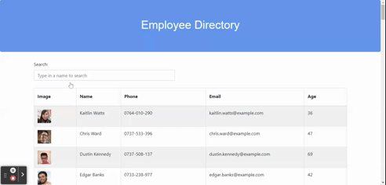

# Employee Directory

## Description 

This React application allows users see a list of employees and filter by name. It can:
* Sort by first name
* Search by first name

## Technologies Used
* React
* JavaScript
* Bootstrap
* API interaction with Axios package
* GitHub pages

## Deployed URL

[Click here for the deployed link!](https://alishasaleh.github.io/employee-directory/)

## Usage

This gif demonstrates the application's functionality:

## License

> This project was created under the [MIT License](https://opensource.org/licenses/MIT)

